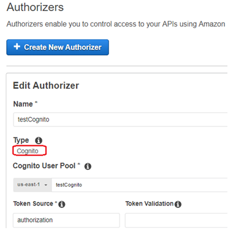
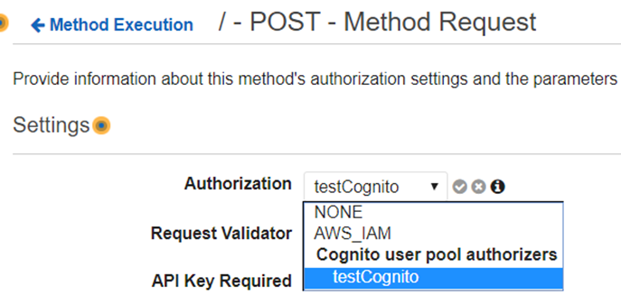

# Images upload API

Create an API to enable system users to securely upload images provided that they are authenticated.

## Requirements (ordered by priority)

* The API must be written using Nodejs - Done
* Use serverless framework - Done
* The API must be deployable to AWS Lambda (you can either use a free aws account or use the serverless-offline library) - Done
* The images must be stored into AWS S3 (you can either create a free aws account or use localstack) -  Done
* Think about security while developing your APIs (it's impossible to have a system 100% secure). [Amazon Cognito](#cognito) - Done
* Create a [GitHub](https://github.com/Prashi121/Tweak-Task) repository with your project. Done
* Documentation - Done
* [Unit or Integration Tests](https://github.com/Prashi121/Tweak-Task/blob/master/Unit-Test.md) - Done
* Extract image metadata (EXIF, IPTC) using image magick (https://imagemagick.org/script/identify.php). - Done
* Store the extracted metadata as a JSON file in the same S3 location the image was saved. - Done
* Expose a User API to Register and Login system users. - Done
* Use of public layers (where necessary) - Not Used

## Amazon Cognito User Pools

- Custom User Directory Pool
- Can use Federated Identities, I.E. Amazon, Facebook, Google, Twitter, Open Connect Providers, and SAML
- Not all AWS region supported
	- Supported regions: Asia Pacific (Mumbai), EU (London), EU (Ireland), EU (Frankfurt), Asia Pacific (Seoul), Asia Pacific (Tokyo), Asia Pacific (Singapore), Asia Paific (Sydney), US East (N. Virginia), US East (Ohio), US West (Oregon)
- Authentication done by AWS Cognito user pool and/or federated security
- Authorization is custom
    - Lambda function can be added to Pre / Post authentication trigger event to customize
- Calling Application need to call AWS COGNITO-IDP to gain identity token
- Identity token need to be included in HTTP header
- Identity token expires after configured duration
- Sample AWS Cognito command, user-pool-id, client-id, username set up in US-EAST-1 
_aws cognito-idp admin-initiate-auth --user-pool-id us-east-1_av3MBvnAd --client-id 4b5q7hpq7hkbpcf3hn82rrbe8v --auth-flow ADMIN_NO_SRP_AUTH --auth-parameters USERNAME=testcognito,PASSWORD=Footba1!_

[AWS Cognito Reference](http://docs.aws.amazon.com/cli/latest/reference/cognito-idp/index.html)

## Cognito Authorizer API Configuration

1. Configure API Authorizer to Use Cognito

2. API Method Request configured to use Cognito Authorization

