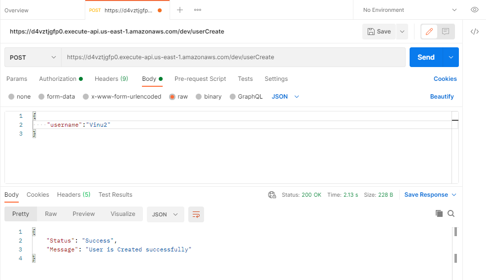
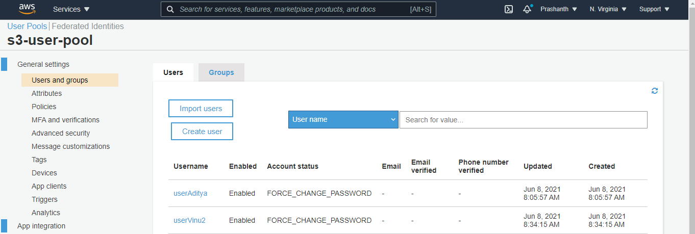
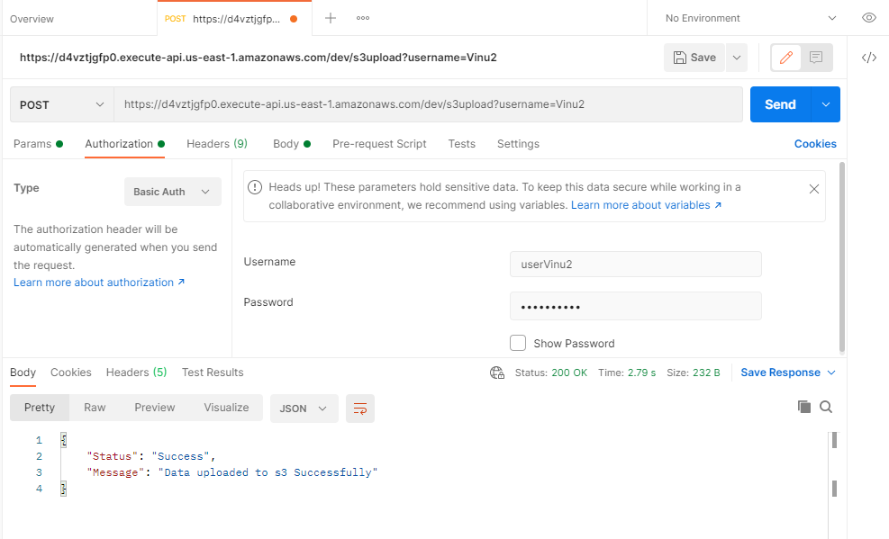
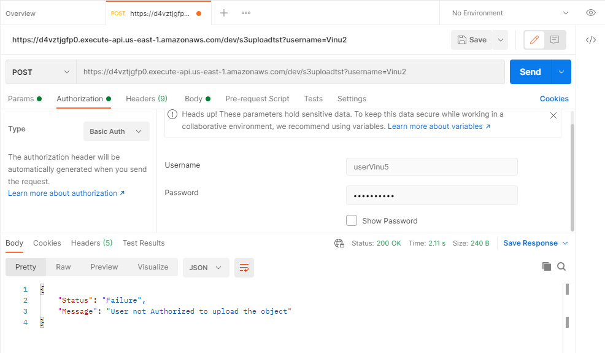
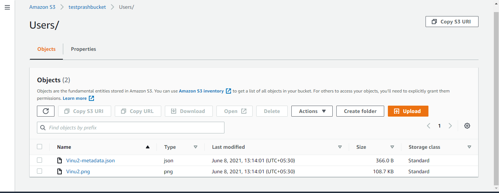
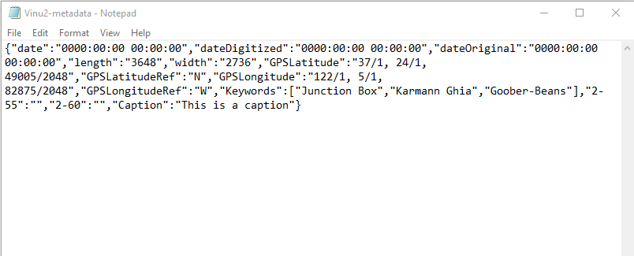

## Unit Test Cases

### Test Case1: Create an User using User API

#### Expected Result: User is created Successfully

### Test Case2: Try to create a User which is alrady exists

#### Expected Result: User already Exists

### Verification of User Created in the Cognito User Pool

### Test Case3: Upload the image to s3 bucket with the user created above

#### Data uploaded to s3 successfully

### Test Case4: Upload the image to s3 bucket with the invalid user

#### User not Authorized to upload the object

### Verification of Upload image in s3 and extract the metadata of the image and store it in s3

### Content of the file Vinu2.jpg

### Content of the file Vinu2-metadata.jpg

